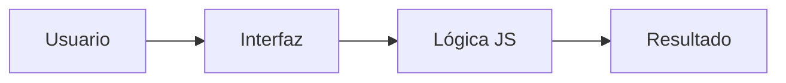

# Calculadora Web
Proyecto en desarrollo


## Descripción

Herramienta que permite hacer operaciones básicas matemáticas (sumar, restar, dividir, multiplicar) en el navegador.


## Tabla de contenidos
- [Descripción](#descripción)
- [Instalación](#instalación)
- [Uso](#uso)
- [Contribuidores](#contribuidores)
- [Funcionalidades](#funcionalidades)
- [Tareas pendientes](#tareas-pendientes)
- [Arquitectura](#arquitectura)

## Instalación
 
```bash
git clone https://github.com/katherin-ac/laboratorio-readme.git
cd laboratorio-readme
npm install
```

## Uso

```bash
npm start
```

## Funcionalidades
| Función | Estado |
|---------|--------|
|  Sumar  |  Listo |
|  Restar |  Listo |
|  Multiplicar | Listo |
|  Dividir |  Listo |

## Tareas pendientes
- [ ] Implementar operaciones matemáticas avanzadas
- [x] Añadir historial de operaciones
- [x]  Diseño responsive
- [ ] Implementar pantalla para gráficos

## Arquitectura


## Contribuidores
- Katherin Arapa Catari ([@katherin-ac](https://github.com/katherin-ac))